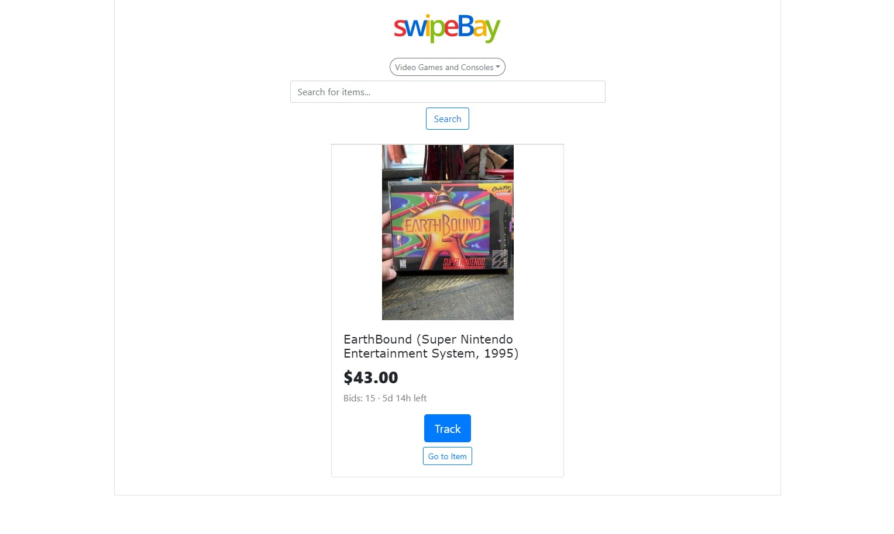

<!-- ABOUT THE PROJECT -->
## SwipeBay

Welcome to SwipeBay! This is a web application supported by the eBay Finding API to search for and track specific items. The server queries the eBay Finding API and displays results through a novel carousel effect.

### Specs

Built with Node/Express framework in JavaScript. Website and server runs locally on my desktop for testing and security purposes.

<!-- USAGE EXAMPLES -->
## Screenshots

