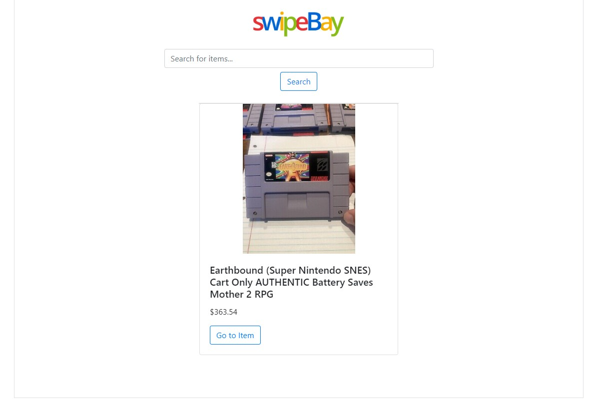

<!-- ABOUT THE PROJECT -->
## About The Project

Welcome to SwipeBay! Sign in and search for an item through eBay's production API. Users can swipe through the results with a novel carousel effect. This project was created to learn usages of APIs and develop my skills in JavaScript. 

### Specs

Built with Node/Express framework in JavaScript. Runs locally on my desktop for testing and security purposes.

<!-- USAGE EXAMPLES -->
## Screenshots

